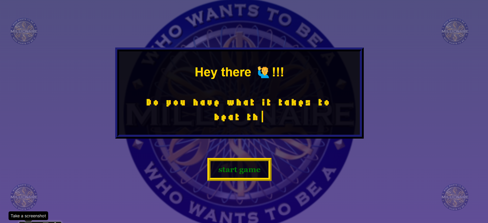
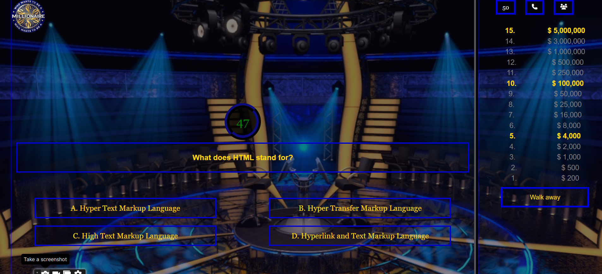

#  Quiz App

This project is to show my proficiency in Html, css and javascript. I structured this quiz project as a "Who Wants to Be a Millionaire" format where users have to correctly answer a series of multiple-choice questions in order to advance to the next level / question. There are 15 questions in total and each question is worth a specific amount of money and a time limit is placed on user to come up with an answer otherwise, you loose the game. Contestants also get three Lifelines to assist them if they get stuck on a particular question.

More updates on the game later .....

#  Deployed to 👇

- Explore [Project Link](https://emerald-millonaire-quiz.netlify.app/)

### Features:
- Call a friend
- 50/50
- Ask the audience
- Display Questions and Answers
- Display Amount won
- Display Timer

### Built with
- Html
- Css
- Javascript

## My Social Media

- LinkedIn - [@emerald](https://www.linkedin.com/in/emmanuel-agimezelu-b1796320b/)
- Twitter - [@agiemerald](https://www.twitter.com/agiemerald)

#### Screenshot👇

- Start page

- Question page

